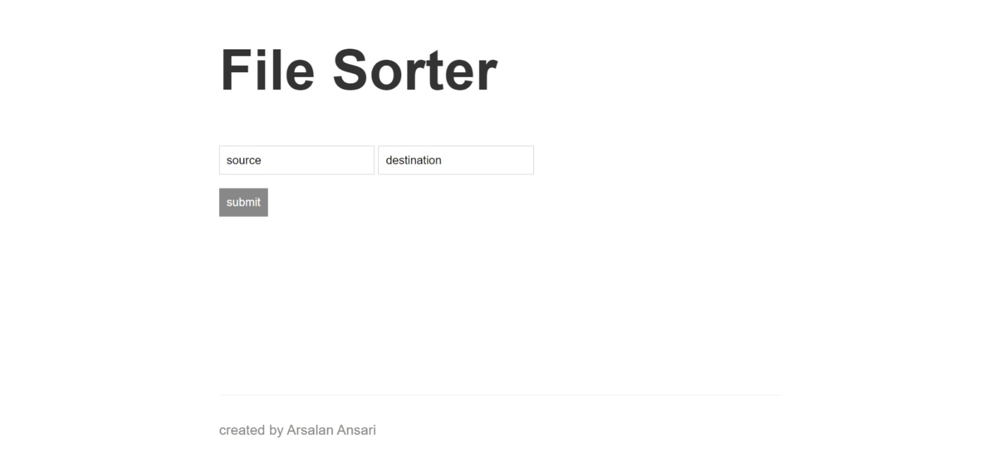

### File Sorter

Project based on **Node.js**, it sorts and groups the files inside a folder according to the date and month of file in which it was created or taken.

### Pre Requisites

- **Node.js** version **21** or greater.

### Available scripts

1. `.\\public\\index.html && node ./src/app.js`.

### Instructions

1. Run `run.cmd` file.

2. Enter the source and destination folder and pre 
